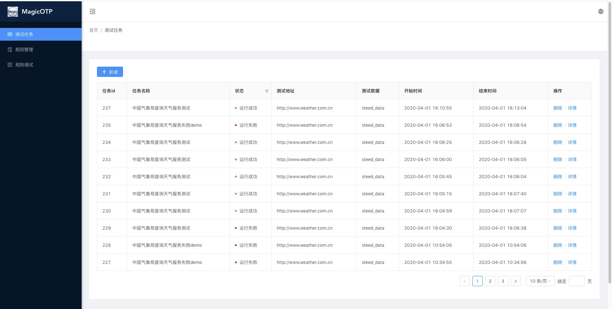
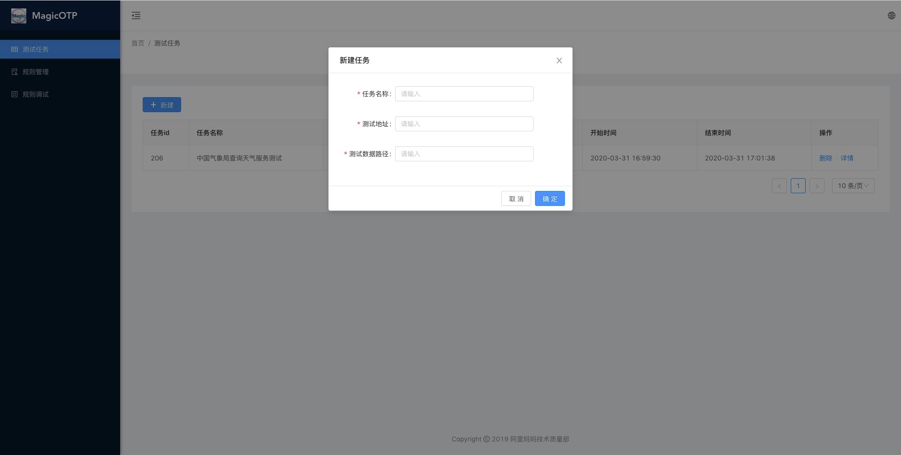
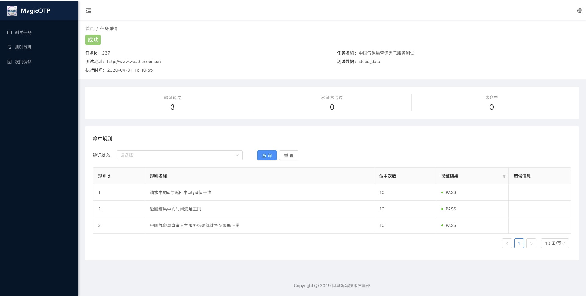
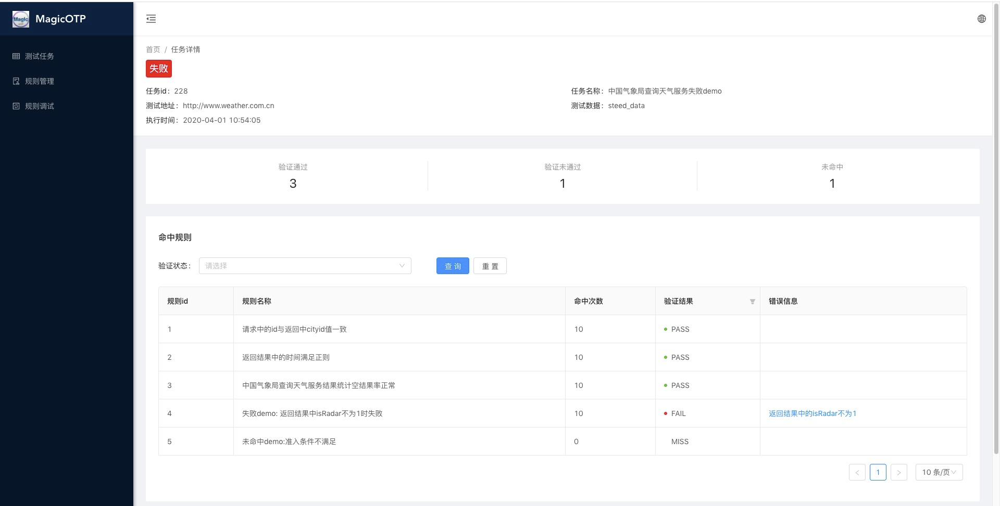
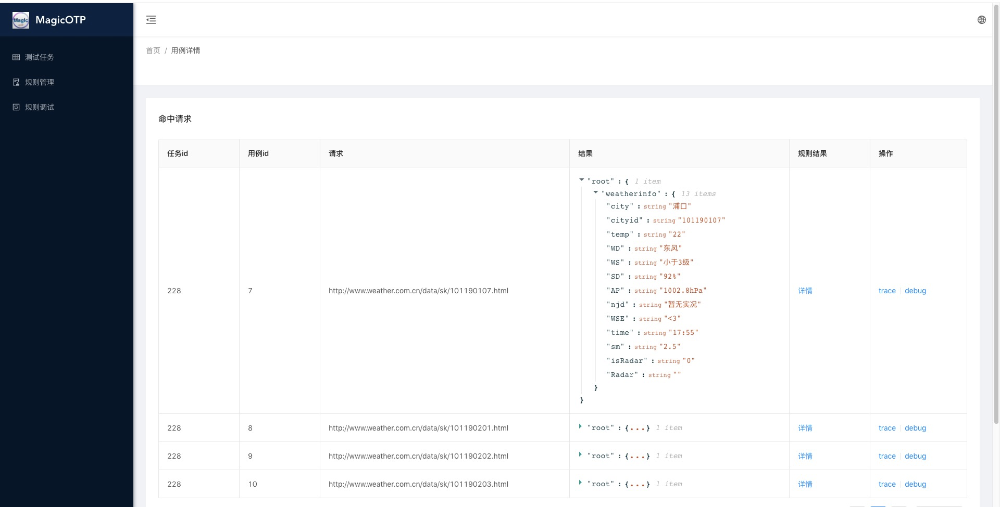
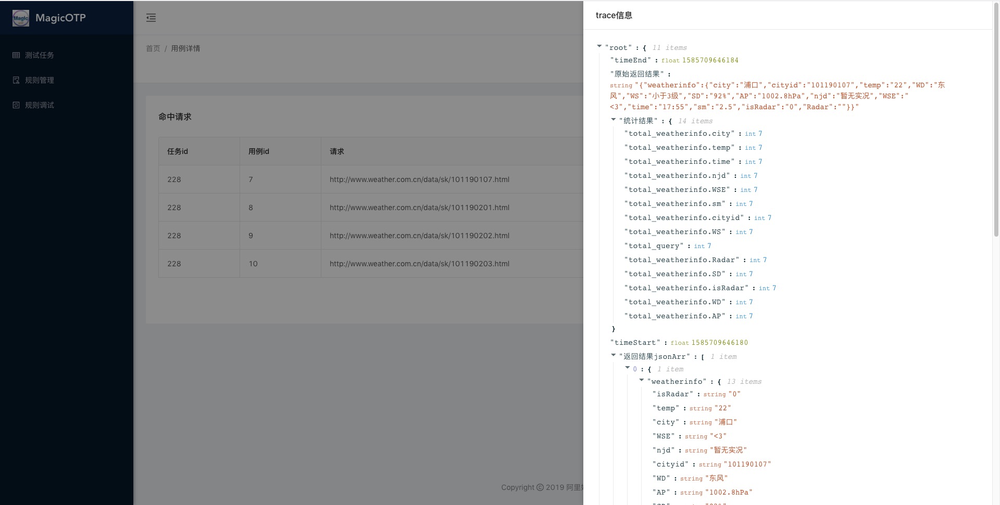
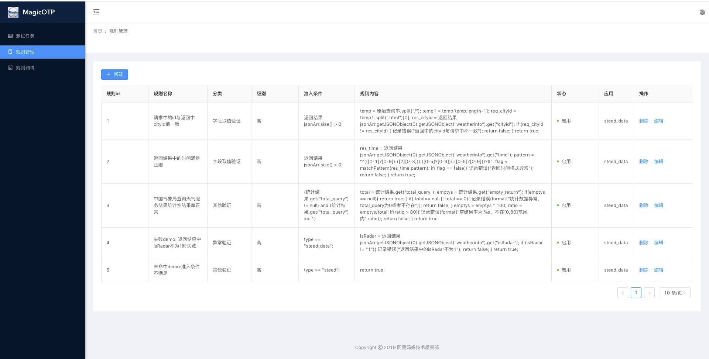
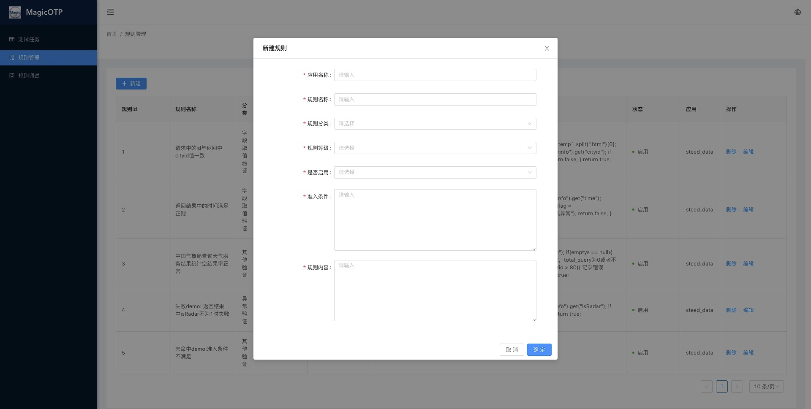
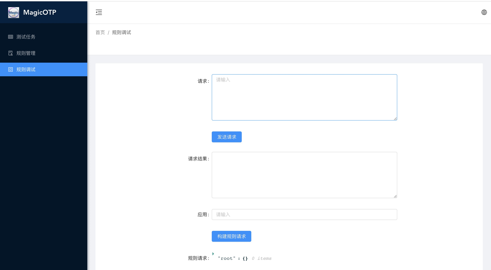

# 开始
## 概述
MagicOTP (Online Test Platform)是一个开源的线上测试平台，思想是通过回放大批量线上真实请求，并结合规则验证的形式对服务返回的结果进行校验。相对于传统测试用例设计中固定的输入和输出数据方式，更能提高数据的覆盖度，对系统稳定性监测提供有力的保障。请求数据来源于线上服务真实请求的收集，验证规则又不依赖于具体请求数据，大大节省了开发和维护的成本。依托此线上测试平台，您只需要根据业务需求梳理添加功能点的校验规则，即可完成接入，快速完成对线上服务的业务逻辑验证工作。

## 环境部署
创建数据库

`create database steed`

`source deployment/database.sql`

修改配置文件中的ip

```
   1. platform/src/main/resources/application.properties
      spring.datasource.url=jdbc:mysql://ip:3306/steed?useSSL=false
      spring.datasource.username=****
      spring.datasource.password=******
      #规则引擎地址
      rule.address=http://ip:9191
```

```
   2. agent/src/main/resources/application.properties
      spring.redis.host=ip
```

```
   3. agent/src/main/resources/applicationContext.xml
      <property name="url" value="jdbc:mysql://ip:3306/steed"/>
```

进入agent目录，启动agent

`mvn clean package`

`java -jar target/RuleEngine.jar`

进入platform，启动platform，完成后即可通过配置的端口号访问（默认访问地址为: ip:9100）

`mvn clean package`

`java -jar target/MagicOTP-1.0-SNAPSHOT.jar`

若需要进行前端页面的修改，进入platform/frontend编辑后，执行以下命令重新部署即可。

`tnpm install`

`tnpm start`

`tnpm run build`

即可开始使用。

在编写统计类规则时，数据存储在redis中，需要安装部署redis数据库。

点击了解更多关于[Ant Design](https://pro.ant.design/)的信息。

## Web页面说明
### 测试任务管理

展示历史任务的信息。


通过填写任务名称、测试地址、测试数据路径信息新建测试任务。


点击任务“详情”，可以查看测试任务的详细信息，包含具体的验证规则通过情况。



当任务存在验证失败的规则时，点击"错误信息"会展示失败的具体请求与返回信息。




点击规则结果，查看一条请求与返回验证的具体规则信息。trace信息记录了在验证该条请求返回式的具体信息，debug则可直接跳转至“规则调试”页面，对当前请求进行调试工作。





### 规则管理

校验规则的展示页面，展示、编辑现有规则，创建新规则。






### 规则调试

在web界面进行规则的调试，输入请求得到请求结果，点击“构建规则请求”即可得到发送到规则引擎的请求信息，再次点击规则验证即可看到结果。




# 教程
## 创建自己应用的线上测试

### 创建请求串文件
    命名与应用名称一致，格式为每行一个请求串。

### 添加规则
    添加业务功能逻辑的规则。

### 本地调试规则
    在规则调试页面，可以发送请求得到结果并发送给规则引擎进行解析，查看规则是否被命中是否通过。

### 创建测试任务
    本地调试完成后，即可创建测试任务，得到多条请求的规则校验结果，实现线上功能逻辑的校验。

目前支持http的请求和json格式的返回。
   
## 规则编写

规则编写应用QL Express，它是由阿里的电商业务规则、表达式（布尔组合）、特殊数学公式计算（高精度）、语法分析、脚本二次定制等强需求而设计的一门动态脚本引擎解析工具。QL Express是弱类型脚本语言，支持大部分java语法：for循环，if判断，函数定义等。点击了解更多关于[QL Express](https://github.com/alibaba/QLExpress)的信息。
 

我们提供了基本的规则常量，如“小于”，“大于”，“matchPattern”等，详细请见[规则常量说明](ruleConstant.md)。

### 字段说明

|   字段   |                                                                                             说明                                                                                             |
|:--------:|:--------------------------------------------------------------------------------------------------------------------------------------------------------------------------------------------:|
| 应用名称 | 规则所属的应用名，与测试数据文件名相同。                                                                                                                                                     |
| 规则名称 | 规则校验功能点的说明。                                                                                                                                                                       |
| 规则分类 | 规则验证点的分类，类别为字段取值验证、功能逻辑验证、去重逻辑验证、异常验证、其他验证。                                                                                                       |
| 规则级别 | 规则的级别。 高（level 1）：规则必须有测试数据命中，且全部通过；中（level 2）：一个任务内至少有一次验证是通过的，其它结果可以存在失败。 低（level 3）：规则可以不被命中，但命中后必须成功。|
| 准入条件 | 规则的准入条件。                                                                                                                                                                             |
| 规则内容 | 规则的具体校验内容。                                                                                                                                                                         |
| 是否启用 | 规则状态，表示当前是否可用。 0表示规则为禁用状态，在冒烟时会被过滤不做校验； 1表示可用状态，在冒烟时会校验该规则。                                                                           |

### 规则示例
```
[name]

统计空结果率正常

[level]

1

[category]

规则统计类接收到的请求数

[when]

(统计结果.get("total_query") != null) and (统计结果.get("total_query") >= 1)

[verify]

total = 统计结果.get("total_query");
emptys = 统计结果.get("empty_return");
if(emptys == null){
      return true;
}
if( total== null || total == 0){
      记录错误(format("统计数据异常，total_query为0或者不存在"));
      return false;
}
emptys = emptys * 100;
ratio = emptys/total;
if(ratio > 80){
      记录错误(format("空结果率为 %s，不在[0,80]范围内",ratio));
      return false;
}
return true;
```

### 规则本地调试

- 进入./online-test-platform/agent/rules/enabled，新建ql文件

- 将application.properties的规则载入方式修改为文件

  `rule.loader = file`

- 使用postman发送请求

  接口：http://ip:9191/testruleengine/smoke

  header：Content-Type  => application/json

  body：
```
  {

    "type":"steed_data",

    "data":{

            "request":"........",

            "response":"........"

    }

  }
```

## 统计类规则添加

   统计类规则是指在redis中记录线上请求回放的统计类信息，如接口返回结果正常的数量、返回结果为空的请求数量等。在代码中，我们提供了SmokedataStatic来记录请求的空结果数在redis中，规则引擎返回的结果中以key“统计结果”来展示，可以根据统计结果验证功能。如果规则的添加需要其他形式的统计信息，可通过实现接口类IStatic自行编写。

## 自定义业务规则解析

在线上测试平台中，我们提供了默认的请求返回结果解析和封装DefaultContextInitializer，如果业务需求不符合现有场景，可自行实现接口类IContextInitializer后调用。